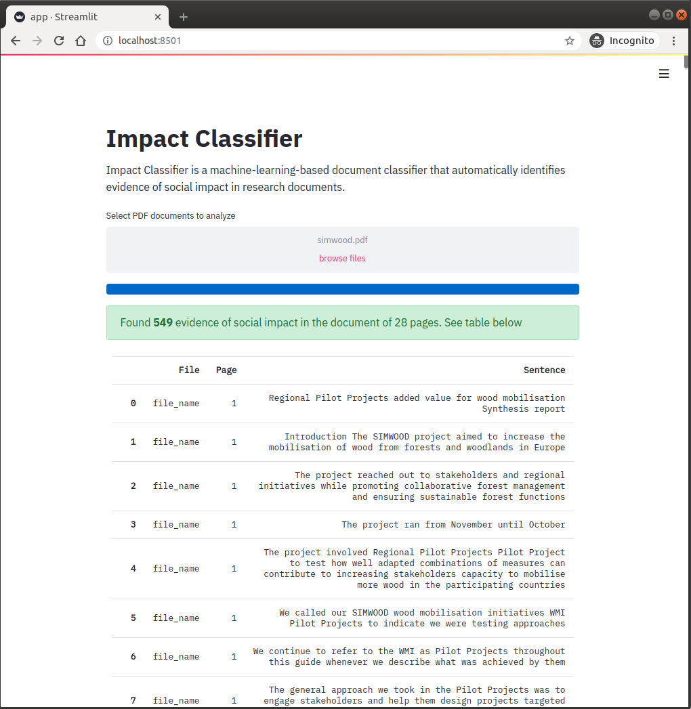

# Impact Classifier

Impact classifier is a project that proposes to leverage machine learning (ML) and natural language processing (NLP) techniques to build a text classifier that facilitate the identification of evidence of social impact in research documents. 

The proposal aims to solve a classification problem in which the model takes a sentence as input and produces as output a binary answer (1=True, 0=False) that states whether the sentence contains or not evidence of social impact.

## Case Study

From all research fields, the project focuses on Medical, Health, and Biological science because the plan is to deploy the solution in the Spanish National Institue of Bioinformatics (INB by its Spanish Acronym) to understanding the social impact of their research projects. INB is an institution that conducts medical and biological investigations.

## Dataset

Training a machine-learning algorithm to automatically identify evidence of social impact in text documents requires having a dataset with examples of sentences that provide evidence of impact. This dataset was built using the summaries of the societal impact of research published by the Research Excellence Framework (REF) of the United Kingdom. Summaries of the social impact of Medical, Health, and Biological research conducted in the United Kingdom have been downloaded from the REF website.  The downloaded dataset containing 571 summaries of the social impact of biological, medical, and health science research are available at `data/source/social_impact_ref_bio_medicine.csv`. Summaries, which are a few paragraph descriptions of how the research has impacted the society, have been split into sentences, resulting in 2,347 sentences that have been assumed all of them contain evidence of social impact.

Sentences with evidence of social impact have been complemented with general sentences that are commonly available in scientific documents in the field of Health and Biology. Here, a set of 29,437 articles of health and biology published as part of the publication [SparkText: Biomedical Text Mining on Big Data Framework](https://www.researchgate.net/publication/308759738_SparkText_Biomedical_Text_Mining_on_Big_Data_Framework) has been used to extract sentences that are usually part of health and biology academic articles. SparkText dataset can be downloaded from [here](https://figshare.com/articles/New_draft_item/3796302). The text of the 29,437 articles has been split into sentences, resulting in 2,318,588 sentences. Then, 3,000 sentences have been ramdonly selected to complement sentences with evidence of social impact. The big assumption in this part of the process is that the selected “general” sentences do not contain evidence of social impact. The dataset of 3,000 sentences can be found in `data/sentences/gral_sentences_3000.csv`.

## Features Generation

Features have been generated through two different strategies. On the one hand, features have been constructed by extracting lexical, syntactic, and semantical information of sentences. On the other hand, features have been built by converting sentences into vectors of tokens.

The following five features to represent different lexical and syntactic characteristics of the sentences: 
1. **Word count of sentences**: total number of words in sentences;
2. **Character count of sentences**: total number of characters in sentences;
3. **Average word density of sentences**: average length of words in sentences;
4. **The upper case count in sentences**: total number of upper count words in sentences;
5. **Title word count in sentences**: total number of title case words in sentences.

Apart from the lexical and syntactic features, the sentiment of sentences has been computed. The reasoning behind this feature is that sentiments can be a promising feature to discriminate between the two types of sentences since sentences with evidence of social impact are expected to have a more positive tone than general sentences.

After computing the lexical, syntactic, and semantic features, the dataset has been split into train and test. Twenty percent of the sentences have been held for testing while the rest have been reserved for training. Sentences in both the train and test sets have been vectorized, converting them into arrays of tokens. Before vectorizing, sentences have been preparing to apply the following combinations of text processing tasks:
1. Sentences are tokenized and stop words, as well as URLs, removed. Stemming is also used;
2. Sentences are tokenized, stop words and URLs are removed, and lemmatization is applied.

Sentences in the train and test sets have passed through the tasks described in (1) and (2), generating four sets of sentences, two pairs of train-test sets. Later, these sets of sentences have passed through transformations that include combinations of different bag-of-words representations. The transformed sentences together with the syntactic and semantic features have been saved into train and test binary files.

## Model Building

In the process of building the model, five algorithms have been trained. In this sense, I have tried the following algorithms: Gaussian Naive-Bayes, Support Vector Machine, Logistic Regression, Random Forest, and Gradient Boosting. Each algorithm has been trained with their default hyper-parameters and using cross-validation on the different train sets. Then, the best performing model of each algorithm has been selected based on the mean of F1 scores obtained from the cross-validation process. Later, a hyper-parameters tuning has been conducting on the best performing models. Following hyper-parametrization, learning curves have been plotted to analyze the overfitting effect on the train set and the effect of the train size on the performance metric. The best model according to its learning curves has been selected. In this sense, the model based on the Logistic Regression algorithm has been found as the best model.

**The best classifier has showed a F1 score of 0.94 on the test set**. The process followed to build the model has been documented in the notebook `1.impact_classifier.ipynb`.

## Implementation

The classifier was implemented in a web application using the open-source app framework [Stremlit](https://www.streamlit.io/). The application allows users to upload research documents in PDF format. After examining the uploaded document page by page and sentence by sentence, it reports the number of potential evidence of social impact found in the document, as shown in the picture below. The report informs the page where the evidence was found as well as the sentence that contains the proof.

